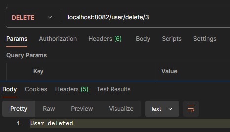

# Тестування працездатності системи

Для перевірки працездатності використовувався застосунок Postman.

Перевірку виконано на таблицях **Project**, **Users**, **Task**.

## Project

### Post

### GET (id)
.png)

### GET (all)
.png)

### PUT

### Delete

## User

### Post

### GET (id)
.png)

### GET (all)
.png)

### PUT

### Delete

## Task

### Post

### GET (id)
.png)

### GET (all)
.png)

### PUT

### Delete
